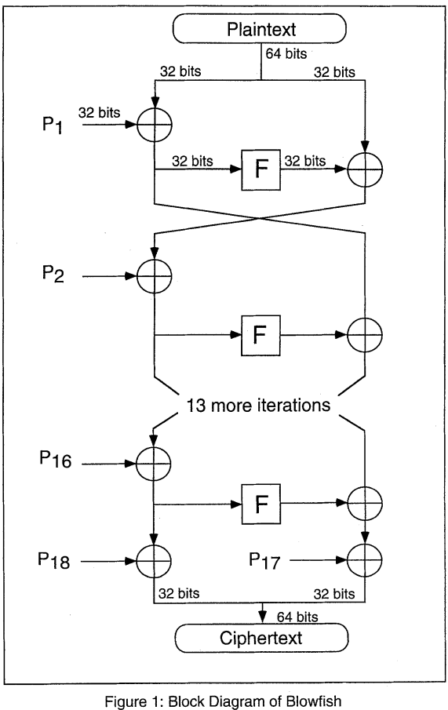
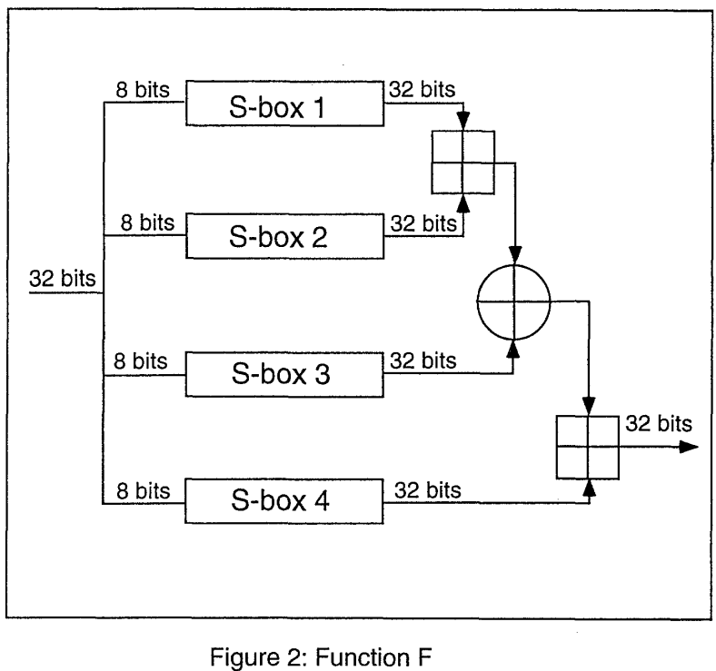

# Parcial 1 Sistemas_Operativos: Uso de Llamadas al Sistema en Linux con C++

# **ALGORITMO DE BLOWFISH**

- Es un cifrador de bloques simétrico.
- No tiene patente y es libre de licencia, cualquier persona lo puede utilizar.
- Muchos criptógrafos han intentaod romper este algoritmo pero no lo han podido hacer.
- Es una red de Feistel.
- El tamaño de bloque es 64 bits.
- Utiliza claves de longitud variable de entre 32 bits a 448 bits.
- Requiere una fase de inicialización compleja antes de entrar a hacer el encriptad.
- Este algoritmo no sirve para generar un nuevo estandar criptográfico, pero sirve para aplicaciones en donde no se necesite cambiar la clave con frecuencia, por ejemplo: enlace de comunicación y **CIFRADOR AUTOMÁTICO DE ARCHIVOS.**
- Es más rápido que el algoritmo de DES cuando se implementa en microprocesadores de 32 bits con grandes cantidades de cachés de datos, como Pentium y PowerPC.

# Descripción del Algoritmo (BLOWFISH).

## 1. El Blowfish es un cifrado de bloques de 64 bits con clave de longitud variable.
## 2. El algoritmo consta de dos partes:
### 1. La expanción de clave.
La expanción de clave convierte una clave de 448 bits como máximo en varias matrices de subclaves que suman un total de 4168 bytes.

### 2. El cifrado de datos.
- El cifrado de datos se produce mediante una red Feistel de 16 rondas.
- Cada ronda consta de:
    - Una permutación dependiente de: la clave.
    - Y una sustitución dependiente de: la clave y los datos.

    Nota 1. Todas las operaciones son XOR y adiciones en palabras de 32 bits (DWORD).

    Nota 2. Las únicas operaciones adicionales son cuatro búsquedas de datos de matrices indexadas por ronda.

### 3. Sub-llaves.
Blowfish utiliza una gran cantidad de subclaves. Estas claves deben calcularse previamente antes de cualquier cifrado o descifrado de datos.

1. La matriz P (matriz de permutaciones) consta de 18 subclaves de 32 bits.

    **P<sub>1</sub>, P<sub>2</sub>... P<sub>18</sub>**

2. Las 4 cajas S (Cajas de sustitución) de 32 bits consta de 256 entradas cada una.

    **S<sub>1,0</sub>, S<sub>1,1</sub> , ... , S<sub>1,256</sub>**

    **S<sub>2,0</sub>, S<sub>2,1</sub> , ... , S<sub>2,256</sub>**
    
    **S<sub>3,0</sub>, S<sub>3,1</sub> , ... , S<sub>3,256</sub>**
    
    **S<sub>4,0</sub>, S<sub>4,1</sub> , ... , S<sub>4,256</sub>**

#### El método para calcular estas subclaves es:

Las subclaves se calculan utilizando el algoritmo Blowfish. El método exacto es el siguiente:

1. Inicialice primero la matriz P y luego las cuatro cajas S, en orden, con una cadena fija. Esta cadena consta de los dígitos hexadecimales de pi (menos el 3 inicial). Por ejemplo:

    P1 = 0x243f6a88

    P2 = 0x85a308d3

    P3 = 0x13198a2e

    P4 = 0x03707344

2. Realice la operación XOR de P1 con los primeros 32 bits de la clave, la operación XOR de P2 con los segundos 32 bits de la clave y así sucesivamente para todos los bits de la clave (posiblemente hasta P14). Repita el ciclo de forma repetida a través de los bits de la clave hasta que toda la matriz P haya sido XORizada con los bits de la clave. (Para cada clave corta, existe al menos una clave más larga equivalente; por ejemplo, si A es una clave de 64 bits, entonces AA, AAA, etc., son claves equivalentes).

3. Cifre la cadena de todos ceros con el algoritmo Blowfish, utilizando las subclaves descritas en los pasos (1) y (2).

4. Reemplace P1 y P2 con la salida del paso (3).

5. Cifre la salida del paso (3) utilizando el algoritmo Blowfish con las subclaves modificadas.

6. Reemplace P3 y P4 con la salida del paso (5).

7. Continúe el proceso, reemplazando todas las entradas de la matriz P, y luego las cuatro cajas S en orden, con la salida del algoritmo Blowfish que cambia continuamente.

En total, se requieren 521 iteraciones para generar todas las subclaves requeridas. Las aplicaciones pueden almacenar las subclaves en lugar de ejecutar este proceso de derivación varias veces.

### 4. Encriptación.
Blowfish es una red Feistel que consta de 16 rondas (ver Figura 1). La entrada es un elemento de datos de 64 bits, x.



```python
Divide x into two 32-bit halves: xL, xR
For i = 1 to 16:
    xL = xL XOR Pi
    xR = F(xL) XOR xR
    Swap xL and xR
Next i
Swap xL and xR (Undo the last swap.)
xR = xR XOR P17
xL = xL XOR P18
Recombine xL and xR

Function F (see Figure 2):
    Divide xL into four eight-bit quarters: a, b, c, and d
    F(xL) = ((S1,a + S2,b mod 232) XOR S3,c) + S4,d mod 232
```



### 5. Desencriptación.
El descifrado es exactamente igual que el cifrado, excepto que **P<sub>1</sub>, P<sub>2</sub>... P<sub>18</sub>** se utilizan en orden inverso.

Las implementaciones de Blowfish que requieren las velocidades más rápidas deben desenrollar el bucle y asegurarse de que todas las subclaves se almacenen en la memoria caché.


# Red de Feistel.
-El cifrado y descifrado son idénticos, sólo requiere de intervenir el orde de las subclaves.
- Es un cifrado simétrico por rondas.
- **El algoritmo es:**
    1.   Se seleccionda una cadena de entre 64 y 128 bits (en nuestro caso es de 64 bits) y se divide en 2 subcadenas, la subcadena izquierda (L) y la subcadena derecha (R).
    2. Se toma una funcion (F) y una clave (Ki).
    3. Se realizan una serie de operaciones complejas con F y Ki y con L y R (se utiliza sólo una subcadena de entre L y R).
    4. La cadena obtenida se cambia por la cadena con la que no se han realizado operaciones, y se siguen haciendo rondas.

# Funciones que necesito usar (Por ahora sólo para mi).
- Tener las constantes P-Array (Para entenderlo mejor "Matrices de Permutaciones") y S-Boxes (Para entenderlo mejor "Cajas de Sustitución").
- Fase de inicialización.
- Encriptado.
- Desencriptado.
- Función F.
- Swap.